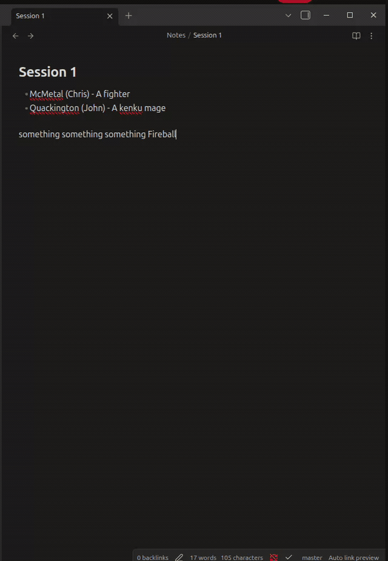
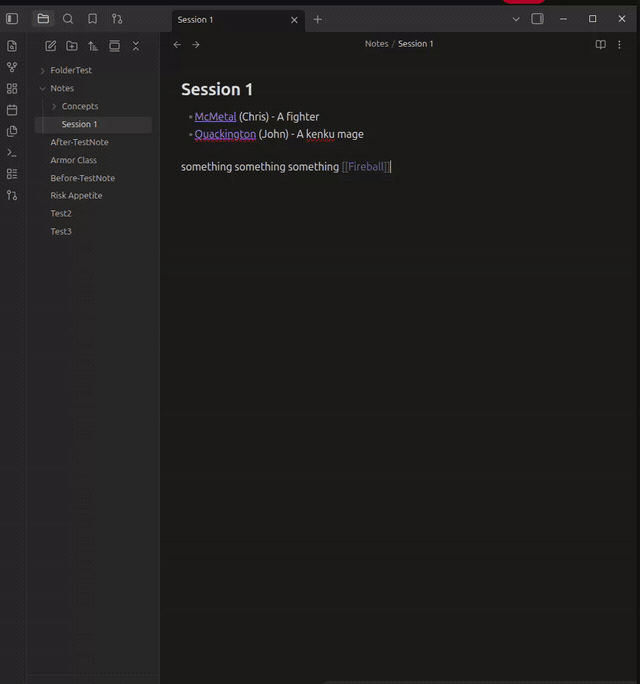

# Obsidian Auto Link Creator

An Obsidian plugin that automatically creates links and notes from your writing. Unlike other linkers that only replace text matching existing notes, this plugin *suggests new links* — driven by list templates, repeated phrases, and NLP keyword detection — and shows you a preview before applying anything. Supports aliases, pluralization, and works great alongside [obsidian-automatic-linker](https://github.com/kdnk/obsidian-automatic-linker).

## Features

### Template-based linking

Write definition lists using templates; the plugin turns them into wiki links and creates the target notes with content.

Default templates (configurable, first match wins):

```
- {{Link Name}} ({{Link Alias}}) - {{Link Content}}
- {{Link Name}} ({{Link Alias}})
- {{Link Name}} - {{Link Content}}
```

Example input:

```md
- Risk Appetite - Level of risk accepted by a company in terms of quantity and severity.
- Access control systems (ACS)
  - Identification
  - Authentication
  - Authorization
```

Result:

```
- [[Risk Appetite]] - Level of risk accepted by a company in terms of quantity and severity.
- [[Access Control Systems|ACS]]
  - Identification
  ...
```

A note `Risk Appetite.md` is created containing the content, plus an `acs` alias on `Access Control Systems`.

### NLP keyword detection

Scans note prose for repeated phrases worth linking:

- Frequency counting with stop-word removal (plus your own extra stop words)
- Lemmatization and singularization: `Cow` ⇄ `Cows`, `Party` ⇄ `Parties`, `Changed/Changing` → `Change`
- Variants are added as aliases so all forms resolve to the same note
- Code blocks are skipped

### Linking to existing notes

Instead of only creating new notes, the plugin can detect phrases that match **existing** note names or aliases and link them — either by exact text match or by NLP root/variant match (`cows` links to a note named `Cow`).

### Preview before applying

Destructive operations go through a preview modal first: see every suggested link, which file it came from and why it was suggested, select/deselect items, then apply. Undo is supported (updated notes can be opened in background leaves for native Ctrl-Z rollback).





## Commands

| Command | Description |
| --- | --- |
| Process current file and preview links | Scan active note, preview suggested links |
| Process current file without preview | Apply directly (respects settings) |
| Link existing notes in current file | Only link phrases matching existing notes |
| Process whole vault and preview links | Scan all notes, batch preview |

With **Link on save** enabled, the active note is processed automatically when saved.

## Settings

- **Templates** — line patterns with `{{Link Name}}`, `{{Link Alias}}`, `{{Link Content}}`
- **Keyword sources** — enable/disable template-based and NLP-based keywords; add extra stop words
- **Ignore code blocks**
- **Link on save**, **Open files for undo**
- **Capitalize names** — capitalize each word of note names/link text
- **Existing notes** — enable, choose exact vs NLP-root matching, optional on-save trigger

New notes are created in the same folder as the source note (or the highest common folder / vault root in vault-wide runs). If a note already exists, its content is appended instead.

## Installation

### From community plugins

1. Open **Settings** → **Community plugins** → **Browse**.
2. Search for **Auto Link Creator**.
3. Click **Install**, then **Enable**.

### Manual install

1. Download `main.js`, `manifest.json`, and `styles.css` from the [latest release](https://github.com/AutumnEvans418/Obsidian-Auto-Link-Creator/releases).
2. Copy them into `<Vault>/.obsidian/plugins/auto-link-creator/`.
3. Reload Obsidian and enable the plugin in Community plugins.

Or via BRAT: add `AutumnEvans418/Obsidian-Auto-Link-Creator` as a custom repository.

## Development

- `npm install`
- `npm run dev` — watch build
- `npm run test` — unit tests (`node --test`)
- `npm run lint` / `npm run build` — lint + typecheck + production bundle

## License

0-BSD — see [LICENSE](LICENSE).
