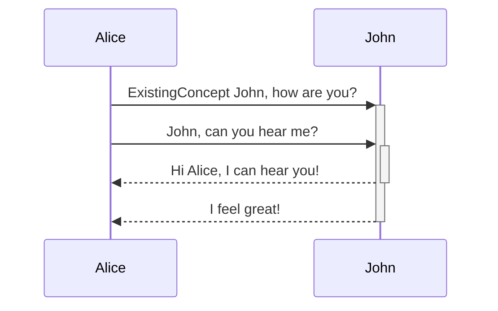

This is your new *vault*.

Make a note of something, create a link, or try [the Importer](https://help.obsidian.md/Plugins/Importer)!

When you're ready, delete this note and make the vault your own.

# List
## Bullets
- [[Test2]] (alias32)
	- Content1
	- Content2

> should create alias32 link with markdown file [[Test2]].md and [[Content]] 
> - Content1
> - Content2

- [[Test3]] (alias) - [[Content]]
> should be [[Test3]].md with alias link and [[Content]]:
> - [[Content]]

- [[Risk Appetite]] - Level of risk accepted.
- [[Access Control Systems]] ([[Access Control Systems]]|[[Access Control Systems|ACS]]) - Controls who enters.
- [[Risk Appetite|Risk Appetites]] - level of risk
> The above should be treated as the same reference as the above.

> The front matter for the added files should add:
```
---
aliases: [alias]
---
- content1
- content2
...
```

- [[Armor Class]] (AC) - The damage threshold
- Armor Classes
- [[Test]]
- [[ExistingConcept]] - [[Test]]

> Expectation:
> 5 files created.

## Numbered
1. [[ExistingConcept]]
2. NewConcept - Definition
3. NewConcept - Def
4. NewConcept2 - Def2
## Tasks
- [ ] [[ExistingConcept]]
- [x] [[ExistingConcept]]
# Code
```md
ExistingConcept
```

```
| First name | Last name |
| ---------- | --------- |
| Max        | ExistingConcept    |
| Marie      | Curie     |
```
## Footnote
[[Test]] [[Test]] ^[[[ExistingConcept]]] [[Test]] [[Test]] [[ExistingConcept]].
# Tables
| Idea            | Desc    |
| --------------- | ------- |
| [[ExistingConcept]] | [[Test]]    |
| Existing        | Concept |
|                 |         |

| First column                                     | Second column                                                                                                      |
| ------------------------------------------------ | ------------------------------------------------------------------------------------------------------------------ |
| [Internal links](https://obsidian.md/help/links) | Link to a file *within* your **vault**.                                                                            |
| [Embed files](https://obsidian.md/help/embeds)   |  |
| [[ExistingConcept]]                                  |                                                                                                                    |

# Syntax
- *[[ExistingConcept]]*
- **[[ExistingConcept]]**
- ~~[[ExistingConcept]]~~
- ***[[ExistingConcept]]***

## Callout
> [[ExistingConcept]]


> [!tip] In Live Preview, you can right-click a table to add or delete columns and rows. You can also sort and [[ExistingConcept]] them using the context menu.

> [!faq]- Are [[Callouts]] foldable?
> Yes! In a foldable callout, the [[Content|Contents]] are hidden when collapsed. [[ExistingConcept]]
## Diagrams



# Html
<iframe src="INSERT [[ExistingConcept]] URL HERE"></iframe>


<table>
<tr>
<td>[[ExistingConcept]]</td>
</tr>
</table>


[[ExistingConcept]]

[[ExistingConcept]]

[[ExistingConcept]]